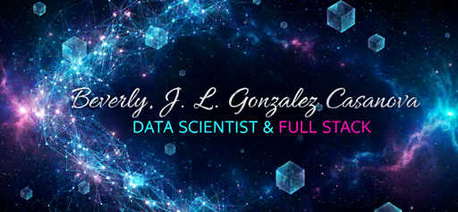

## Hi there 👋

## 📖 About me
 
🎶 Aficionada del metal sinfónico y la vida en el campo 🌿  

💻 Soy **Técnica Superior en Ciencia de Datos e Inteligencia Artificial**, y Téc. Sup. en Gestión y Mantenimiento de Equipamiento Biomédico.  

🎓 Actualmente estudio **Licenciatura en Administración y Gestión de la Información** y cursé 3 años de Lic. en Física Médica.  

🌱 Ampliando mis habilidades en **desarrollo full stack** (especialmente back-end), explorando la transición de **Web2 a Web3**.  

🔬 Mi principal interés es la intersección entre IA, salud y sistemas de información.  

🔭 Para aplicar mis conocimientos, desarrollo proyectos personales de ciencia de datos, IA y desarrollo web para mi portfolio.  

🤝 Contribución y formación:

* Busco contribuir a proyectos open source de ciencia de datos y desarrollo web que resuelvan problemas del mundo real.

* Participo activamente en el bootcamp Digitalers de Inteligencia Artificial y en Dev3Pack.

##  Skills  

<table style="border-collapse: collapse; width: 90%; background: linear-gradient(135deg, #0d1117 0%, #161b22 100%); border-radius: 15px; overflow: hidden; box-shadow: 0 10px 30px rgba(0, 0, 0, 0.4); border: 1px solid #30363d;">
    <tr style="background: linear-gradient(135deg, #6c63ff 0%, #8b5cf6 100%);">
        <th style="padding: 12px;">📂 Categoría</th>
        <th style="padding: 12px;">⚙️ Tecnologías</th>
    </tr>

<!-- Data Science -->
<tr>
    <td style="padding: 12px; font-weight: bold;">📊 Data Science</td>
    <td style="padding: 12px;">
        
        
        
        
        
    </td>
</tr>

<!-- IA & ML -->
<tr>
    <td style="padding: 12px; font-weight: bold;">🤖 IA & Machine Learning</td>
    <td style="padding: 12px;">
        
        
        
        
        
        <!-- Modelos avanzados -->
        
        
        <!-- NLP -->
        
        
        
        <!-- Computer Vision 
        -->
        <!-- MLOps 
        
        
        
        -->
    <td>
<tr>

<!-- Database -->
<tr>
    <td style="padding: 12px; font-weight: bold;">🗄️ Database</td>
    <td style="padding: 12px;">
        
        
        
        
    </td>
</tr>

<!-- Frontend -->
<tr>
    <td style="padding: 12px; font-weight: bold;">🎨 Frontend</td>
    <td style="padding: 12px;">
        
        
        
        
        
        
    </td>
</tr>

<!-- Backend -->
<tr>
    <td style="padding: 12px; font-weight: bold;">⚙️ Backend</td>
    <td style="padding: 12px;">
        
        
        
        
    </td>
</tr>

<!-- Blockchain -->
<tr>
    <td style="padding: 12px; font-weight: bold;">⛓️ Blockchain & Web3</td>
    <td style="padding: 12px;">
        
        
    </td>
</tr>

<!-- DevOps -->
<tr>
    <td style="padding: 12px; font-weight: bold;">☁️ DevOps & Cloud</td>
    <td style="padding: 12px;">
        
        
        
        
    </td>
</tr>

<!-- Testing -->
<tr>
    <td style="padding: 12px; font-weight: bold;">🧪 Testing</td>
    <td style="padding: 12px;">
        
    </td>
</tr>

</table>

## <b> Github Stats </b>

<!-- Stats generales en dos columnas -->
<table>
<tr>
    <td>
        
    </td>
    <td>
        
    </td>
</tr>
</table>
<table>
<tr>
<td>
    
</td>
<td>

<tr>
</table>
<!-- Lenguajes más usados (repos y commits) -->
<table>
    <tr>
        <td>
            
        </td>
        <td>
            
        </td>
    </tr>
</table>

## 🏆 GitHub Trophies

### 🌐 Conectemos:

**Profesional:**  
   

**Social / Contacto:**  
    
