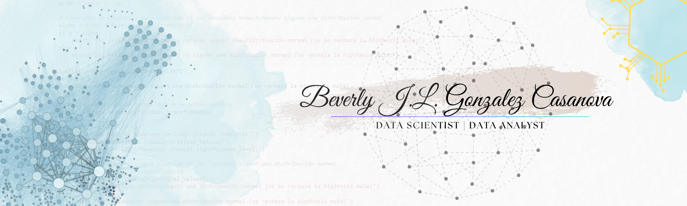

## Hi there 👋

## 📖 About me

* 💻 I'm a senior technician in data science and artificial intelligence.

* 🔭 I’m currently working on building a portfolio of data science projects showcasing my skills in Python, R, and SQL.

* 🌱 I’m currently learning Full-stack development with a focus on front-end  and back-end.

* 🎓 I am a student of Medical Physics.

* 👯 I'm looking to work on open source data science projects that tackle real-world problems, and a web development project where I can contribute to both front-end and back-end.

## 👨‍💻 Languages and Tools:

<h3 align="left"></h3>
<table>
    <tr>
        <td style="font-weight: bold; padding-right: 10px; vertical-align: center; border: none;">Data Sciencie:</td>
        <td></td>
    </tr>
    <tr>
        <td style="font-weight: bold; padding-right: 10px; vertical-align: center; border: none;">Database:</td>
        <td></td>
    </tr>
    <tr>
        <td style="font-weight: bold; padding-right: 10px; vertical-align: center;">Frontend:</td>
        <td></td>
    </tr>
        <tr>
        <td style="font-weight: bold; padding-right: 10px; vertical-align: center; border: none;">Backend:</td>
        <td></td>
    </tr>
    <tr>
        <td style="font-weight: bold; padding-right: 10px; vertical-align: center; border: none;">DevOps:</td>
        <td></td>
    </tr>
    <tr>
        <td style="font-weight: bold; padding-right: 10px; vertical-align: center; border: none;">Version Control:</td>
        <td></td>
    </tr>
    <tr>
        <td style="font-weight: bold; padding-right: 10px; vertical-align: center; border: none;">Ides:</td>
        <td></td>
    </tr>
    <tr>
        <td style="font-weight: bold; padding-right: 10px; vertical-align: center; border: none;">Automated test:</td>
        <td></td>
    </tr>
</table>

#

<h1>
    
</h1>

