<!-- HEADER -->

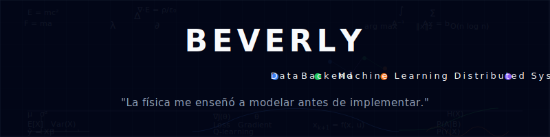

 

---

### Sobre mí / About

Antes de escribir código necesito entender el problema. Me interesa descubrir cómo funciona un sistema antes de decidir cómo implementarlo.

Mi formación combina ciencia de datos, física, tecnología biomédica y sistemas de información. Esa combinación me llevó a disfrutar proyectos donde el análisis, la arquitectura y la implementación forman parte de una misma solución.

*I enjoy designing systems where data, software and decision-making work together—not as separate components, but as one coherent system.*

---

### Stack

<a>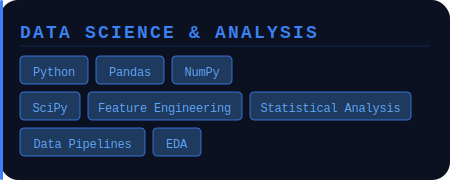</a>
<a>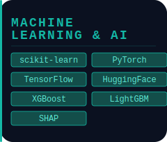</a>
<a>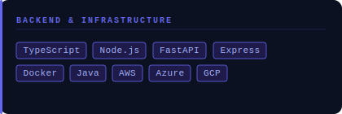</a>
<a>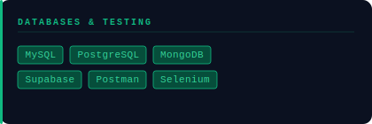</a>
<a>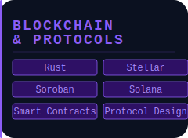</a>

---

### Projects

#### Data & Machine Learning

<a href="https://github.com/licette32/scorythm">
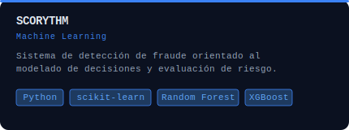
</a>

<a href="https://github.com/licette32/geospatial-water-quality-ml">
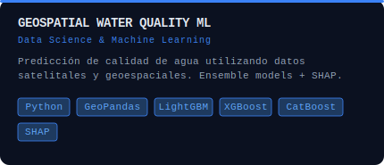
</a>
<a href="https://github.com/licette32/distributed-energy-analytics">
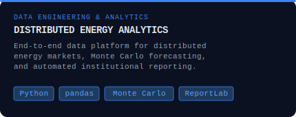
</a>

 

#### Web3 & Protocol Design

<a href="https://github.com/licette32/medovant-protocol">
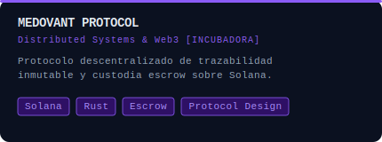
</a>

<a href="https://github.com/migo-labs/migo-protocol">
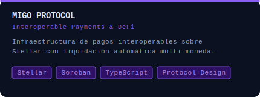
</a>
<a href="https://github.com/BuenDia-Builders/be-energy">
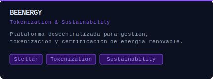
</a>

---

### Open Source Contributions

Contribuyo de forma activa en el desarrollo de infraestructura, optimización de backend y diseño de arquitectura para protocolos distribuidos y sistemas analíticos.

---

### Stats

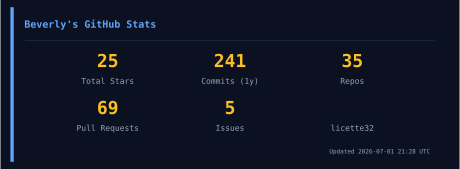
&nbsp;&nbsp;
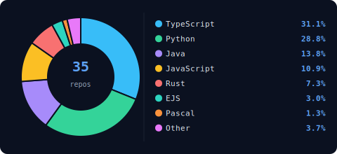

---

### Contacto / Contact

&nbsp;

&nbsp;

&nbsp;

---